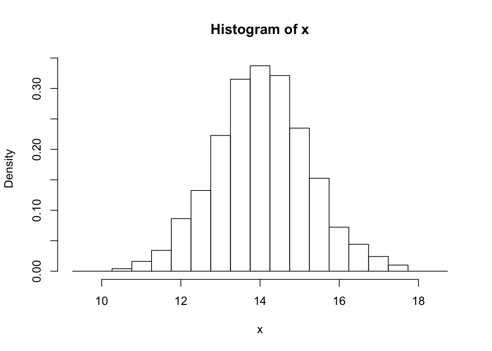
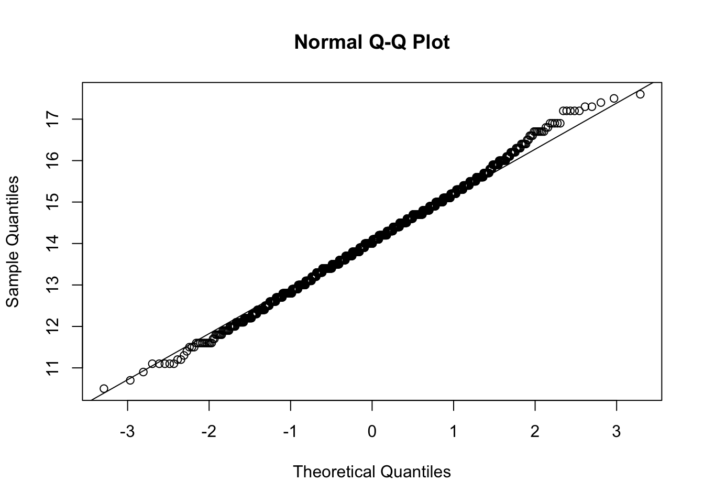
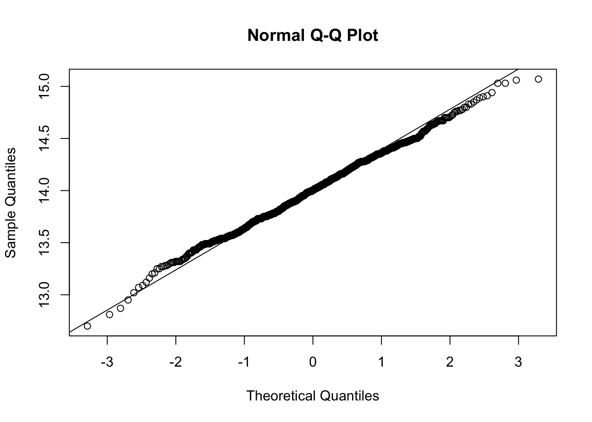
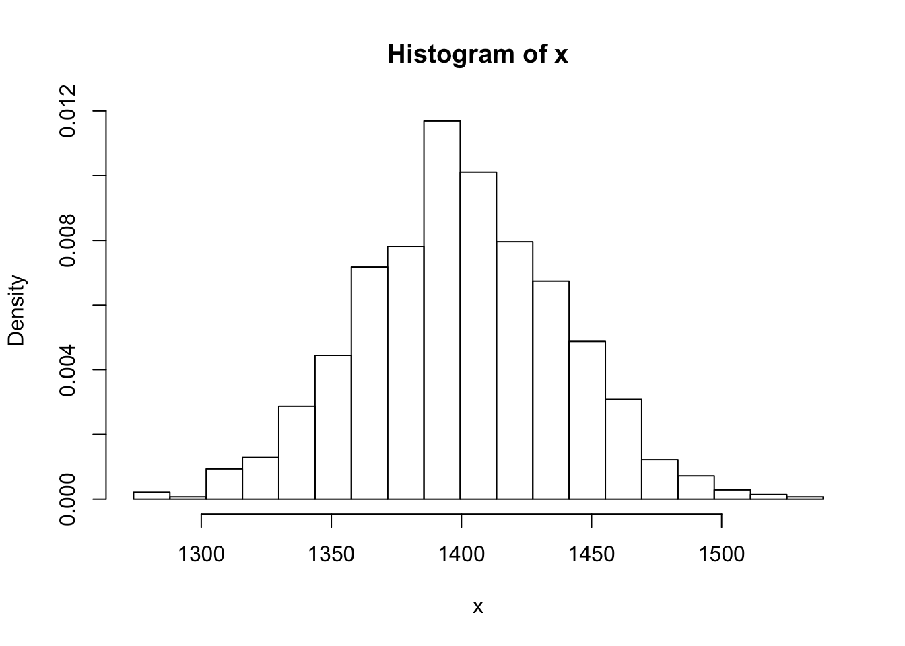
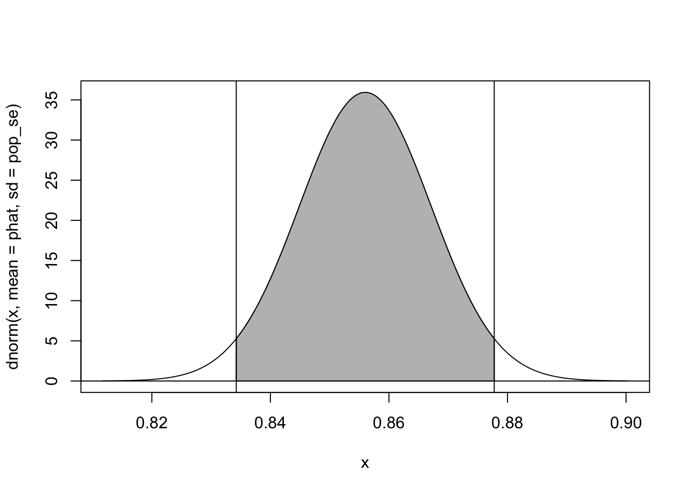
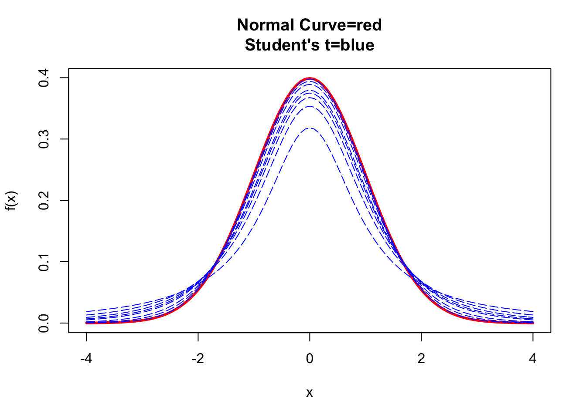

Module 09
================
by Anthony Di Fiore and Christopher A. Schmitt

Introduction to Statistical Inference
=====================================

Preliminaries
-------------

-   Install this package in ***R***: {curl}

Objectives
----------

> The objective of this module is to continue our discussion of *statistical inference* and introduce basic *hypothesis testing* from a frequentist/classical statistics approach.

Standard Errors and Confidence Intervals
----------------------------------------

To recap some of what we have covered in the last two modules, standard errors are key to calculating confidence intervals and to basic inferential statistics.

In Module 7, we calculated confidence intervals for one of our estimates of a population parameter (the population mean, an **estimand**), based on a sample statistic (the sample mean, our **estimator**). Let's revist that process...

The general way to define a confidence interval based on data from a sample is as the value of the **statistic** being considered (e.g., the mean) ± some **critical value** × the **standard error** of the statistic.

The **critical value** is derived from the standardized version of a sampling distribution (e.g., the normal distribution) that corresponds the quantile limits we are interested in. For example, for the 95% CI around the mean, the critical value corresponds the range of quantiles above and below which we expect to see only 5% of the distribution of statistic values. This is equivalent to the ± 1 - (*α*/2) quantiles, where *α*=0.05, i.e., the ± 0.975 quantile that we have used before for calculating 95% CIs.

The **standard error** is the standard deviation of the sampling distribution, which, as noted above, is often estimated from the sample itself as *σ*/sqrt(*n*) but can also be calculated directly from the population standard deviation, if that is known.

Recall that in Module 8, we created a vector, *v*, containing 1000 random numbers selected from a normal distribution with mean 3.5 and standard deviation 4. We then calculated the mean, standard deviation, and standard error of the mean (SEM) based on a sample of 30 observations drawn from that vector, and we used the normal distribution to characterize the quantiles associated with the central 95% of the distribution to define the upper and lower bounds of the 95% CI.

``` r
n <- 1000
mu <- 3.5
sigma <- 4
v <- rnorm(n, mu, sigma)
s <- sample(v, size = 30, replace = FALSE)
m <- mean(s)
m
```

    ## [1] 3.917889

``` r
sd <- sd(s)
sd
```

    ## [1] 3.140071

``` r
sem <- sd(s)/sqrt(length(s))
sem
```

    ## [1] 0.5732959

``` r
lower <- m - qnorm(1 - 0.05/2) * sem  # (1-alpha)/2 each in the upper and lower tails of the distribution
upper <- m + qnorm(1 - 0.05/2) * sem  # (1-alpha)/2 each in the upper and lower tails of the distribution
ci <- c(lower, upper)
ci
```

    ## [1] 2.794250 5.041528

The Central Limit Theorem
-------------------------

Thus far, our construction of CIs has implicitly taken advantage of one of the most important theorems in statistics, the **Central Limit Theorem**. The key importance of the CLT for us is that it states that the distribution of averages (or sums or other summary statistics...) of **iid** (independent and identically distributed) random variables becomes normal as the sample size increases. It is this fact that allows us to have a good sense of the mean and distribution of average events in a population even though we only observe one set of events and do not know what actual population distribution is. In fact, the CLT says nothing about the probability distribution for events in the original population, and that is exactly where its usefulness lies... that original probability distribution can be normal, skewed, all kinds of odd!

But we can nonetheless assume normality for the distribution of **sample mean** (or of the sum or mode, etc...) no matter what kind of probability distribution characterizes the initial population, as long as our sample size is large enough and our samples are independent. It is thus the CLT that allows us to make inferences about a population based on a sample.

Just to explore this a bit, let's do some simulations. We are going to take lots of averages of samples from a particular non-normal distribution and then look at the distribution of those averages. Imagine we have some event that occurs in a population according to some probability mass function like the Poisson where we know *λ*=14. Recall, then, that the expectations of *μ* and *σ*<sup>2</sup> for the Poisson distribution are both=*λ*.

Now let's imagine taking a bunch of samples of size 10 from this population. We will take 1000 random samples of this size, calculate the average of each sample, and plot a histogram of those averages... it will be close to normal, and the standard deviation of the those average - i.e., of the sampling distribution - should be roughly equal to the estimated standard error, the square root of (*λ*/*n*). \[Recall that *λ* is the expected variance, so this is simply the square root of (expected variance / sample size)\]

``` r
lambda <- 14
n <- 10
pop_se <- sqrt(lambda/n)  # the estimated SE
pop_se
```

    ## [1] 1.183216

``` r
x <- NULL
for (i in 1:1000) {
    x[i] <- mean(rpois(n = n, lambda = lambda))
}
hist(x, breaks = seq(from = lambda - 4 * sqrt(lambda)/sqrt(n), to = lambda + 
    4 * sqrt(lambda)/sqrt(n), length.out = 20), probability = TRUE)
```



``` r
sd <- sd(x)  # st dev of the sampling distribution
sd
```

    ## [1] 1.169534

``` r
qqnorm(x)
qqline(x)
```

 Let's do this for samples of size 100, too. We see that the mean stays the same, the distribution is still normal, but the standard deviation - the spread - of the sampling distribution is lower.

``` r
n <- 100
pop_se <- sqrt(lambda/n)  # the estimated SE
pop_se
```

    ## [1] 0.3741657

``` r
x <- NULL
for (i in 1:1000) {
    x[i] <- mean(rpois(n = n, lambda = lambda))
}
hist(x, breaks = seq(from = lambda - 4 * sqrt(lambda)/sqrt(n), to = lambda + 
    4 * sqrt(lambda)/sqrt(n), length.out = 20), probability = TRUE)
```


``` r
sd <- sd(x)  # st dev of the sampling distribution
sd
```

    ## [1] 0.3742317

``` r
qqnorm(x)
qqline(x)
```



We can convert these distributions to standard normals by subtracting off the expected population mean (*λ*) and dividing by the standard error of the mean (an estimate of the standard deviation of the sampling distribution) and then plotting a histogram of those values along with a normal curve.

``` r
curve(dnorm(x, 0, 1), -4, 4, ylim = c(0, 0.8))
z <- (x - lambda)/pop_se
hist(z, breaks = seq(from = -4, to = 4, length.out = 20), probability = TRUE, 
    add = TRUE)
```


Pretty normal looking, right?

Here's an example of the CLT in action using `sum()` instead of `mean()`...

``` r
n <- 100
x <- NULL
for (i in 1:1000) {
    x[i] <- sum(rpois(n = n, lambda = lambda))
}
hist(x, breaks = seq(min(x), max(x), length.out = 20), probability = TRUE)
```



Again, pretty normal looking!

**Take Home Points:**

\[1\] The CLT states that, regardless of the underlying distribution, the distribution of averages (or sums or standard deviations, etc...) based on a large number of independent, identically distributed variables:

-   will be approximately normal,
-   will be centered at the population mean, and – will have a standard deviation roughly equal to the standard error of the mean.

Additionally, it suggests that variables that are expected to be the sum of multiple independent processes (e.g., measurement errors) will also have distributions that are nearly normal.

\[2\] Taking the mean and adding and subtracting the relevant standard normal quantile × the standard error yields a confidence interval for the mean, which gets wider as the coverage increases and gets narrower with less variability or larger sample sizes.

\[3\] As sample size increases, the standard error of the mean decreases and the distribution becomes more and more normal (i.e., has less skew and kurtosis, which are higher order moments of the distribution).

For a nice interactive simulation demonstrating the Central Limit Theorem, check out [this cool website](http://onlinestatbook.com/stat_sim/sampling_dist/index.html) .

Confidence Intervals for Sample Proportions
-------------------------------------------

So far, we've talked about CIs for sample means, but what about for other statistics, e.g., sample proportions for discrete binary variables. For example, if you have a sample of **n** trials where you record the success or failure of a binary event, you obtain an estimate of the proportion of successes, *x*/*n*. If you perform another **n** trials, the new estimate will vary in the same way that averages of a continuous random variable (e.g., zombie age) will vary from sample to sample. Taking a similar approach as above, we can generate confidence intervals for variability in the proportion of successes across trials.

Recall from our discussion of discrete random binary variables that the expectation for proportion of successes, which we will denote as *π* (where *π*, for "proportion", is analogous to *μ*, for "mean") is simply the average number of successes across multiple trials.

The expected sampling distribution for the proportion of successes is approximately normal centered at *π* and its standard deviation is estimated by sqrt(*π*(1 − *π*)/*n*), which is, essentially, the standard error of the mean: it is the square root of (the expected variance / sample size). As above for *μ*, if we do not already have a population estimate for *π*, we can estimate this from a sample as  = *x*/*n*

Note: this expectation based on an approximation of the normal holds true only if both *n* × *π* and *n* × (1 − *π*) are greater than roughly 5, so we should check this when working with proportion data.

#### CHALLENGE:

Suppose a polling group in the Massachusetts is interested in the proportion of voting-age citizens in their state that already know they will vote for Elizabeth Warren in the upcoming November 6, 2018 midterm elections ([don't forget to vote!](https://ballotpedia.org/Massachusetts_elections,_2018)). The group obtains a yes or no answer from 1000 suitable randomly selected individuals. Of these individuals, 856 say they know they’ll vote for Senator Warren. How would we characterize the mean and variability associated with this proportion?

``` r
n <- 1000
x <- 856
phat <- x/n  # our estimate of pi
phat
```

    ## [1] 0.856

Are *n* × *π* and *n* × (1 − *π*) both &gt; 5? Yes!

``` r
n * phat
```

    ## [1] 856

``` r
n * (1 - phat)
```

    ## [1] 144

``` r
pop_se <- sqrt((phat) * (1 - phat)/n)
```

So, what is the 95% CI around our estimate of the proportion of people who already know how they will vote?

``` r
curve(dnorm(x, mean = phat, sd = pop_se), phat - 4 * pop_se, phat + 4 * pop_se)
upper <- phat + qnorm(0.975) * pop_se
lower <- phat - qnorm(0.975) * pop_se
ci <- c(lower, upper)
polygon(cbind(c(ci[1], seq(from = ci[1], to = ci[2], length.out = 1000), ci[2]), 
    c(0, dnorm(seq(from = ci[1], to = ci[2], length.out = 1000), mean = phat, 
        sd = pop_se), 0)), border = "black", col = "gray")
abline(v = ci)
abline(h = 0)
```



Small Sample Confidence Intervals
---------------------------------

Thus far, we have discussed creating a confidence interval based on the CLT and the normal distribution, and our intervals took the form:

*mean* ± *Z* (the quantile from the standard normal curve) × *standard error of the mean*

But, when the size of our sample is small (n &lt; 30), instead of using the normal distribution to calculate our CIs, statisticians typically use a different distribution to generate the relevant quantiles to multiply the standard error by... the **t distribution** (a.k.a., Gosset's t or Student's t distribution).

Note that this is the **typical** case that we will encounter, as we often do not have information about the population that a sample is drawn from.

The t distribution is a continuous probability distribution very similar in shape to the normal is generally used when dealing with *statistics* (such as means and standard deviations) that are estimated from a sample rather than known population *parameters*. Any particular t distribution looks a lot like a normal distribution in that it is bell-shaped, symmetric, unimodal, and (if standardized) zero-centered.

The choice of the appropriate t distribution to use in any particular statistical test is based on the number of **degrees of freedom (df)**, i.e., the number of individual components in the calculation of a given statistic (such as the standard deviation) that are “free to change”.

We can think of the t distribution as representing a family of curves that, as the number of degrees of freedom increases, approaches the normal curve. At low numbers of degrees of freedom, the tails of the distribution get fatter.

Confidence intervals based on the t distribution are of the form:

*mean* ± *T* (the quantile from the t distribution) × *standard error of the mean*

The only change from those based on the normal distribution is that we’ve replaced the ***Z*** quantile of the standard normal with a ***T*** quantile.

Let's explore this a bit...

Recall that a standard normal distribution can be generated by normalizing our sample (subtracting the population mean from each observation and then dividing all of these differences by the population standard deviation)...

(mean(x)-*μ*)/*σ*

If we subtract the population mean from each observation but then divide each difference, instead, by the standard error of the mean, (mean(x)-*μ*)/SEM, the result is not a normal distribution, but rather a t distribution! We are taking into account sample size by dividing by the standard error of the mean rather than the population standard deviation.

The code below plots a standard normal distribution and then t distributions with varying degrees of freedom, specified using the `df=` argument. As for other distributions, ***R*** implements `density`, cumulative `probability`, `quantile`, and `random` functions for the t distribution.

``` r
mu <- 0
sigma <- 1
curve(dnorm(x, mu, 1), mu - 4 * sigma, mu + 4 * sigma, main = "Normal Curve=red\nStudent's t=blue", 
    xlab = "x", ylab = "f(x)", col = "red", lwd = 3)
for (i in c(1, 2, 3, 4, 5, 10, 20, 100)) {
    curve(dt(x, df = i), mu - 4 * sigma, mu + 4 * sigma, main = "T Curve", xlab = "x", 
        ylab = "f(x)", add = TRUE, col = "blue", lty = 5)
}
```



The fatter tails of the t distibution lead naturally to more extreme quantile values given a specific probability than we would see for the normal distribution. If we define a CI based on quantiles of the t distribution, they will be correspondingly slightly wider than those based on the normal distribution for small values of df.

We can see this as follows. Recall that above we estimated the 95% CI for a sample drawn from a normal distribution as follows:

``` r
n <- 1e+05
mu <- 3.5
sigma <- 4
x <- rnorm(n, mu, sigma)
sample_size <- 30
s <- sample(x, size = sample_size, replace = FALSE)
m <- mean(s)
m
```

    ## [1] 3.53508

``` r
sd <- sd(s)
sd
```

    ## [1] 4.605841

``` r
sem <- sd(s)/sqrt(length(s))
sem
```

    ## [1] 0.8409077

``` r
lower <- m - qnorm(1 - 0.05/2) * sem  # (1-alpha)/2 each in the upper and lower tails of the distribution
upper <- m + qnorm(1 - 0.05/2) * sem  # (1-alpha)/2 each in the upper and lower tails of the distribution
ci_norm <- c(lower, upper)
ci_norm
```

    ## [1] 1.886931 5.183229

Now, let's look at the CIs calculated based using the t distribution for the same sample size. For sample size 30, the difference in the CIs is negligible.

``` r
lower <- m - qt(1 - 0.05/2, df = sample_size - 1) * sem  # (1-alpha)/2 each in the upper and lower tails of the distribution
upper <- m + qt(1 - 0.05/2, df = sample_size - 1) * sem  # (1-alpha)/2 each in the upper and lower tails of the distribution
ci_t <- c(lower, upper)
ci_t
```

    ## [1] 1.815231 5.254929

However, if we use a sample size of 5, the CI based on the t distribution is much wider.

``` r
sample_size <- 5
s <- sample(x, size = sample_size, replace = FALSE)
m <- mean(s)
m
```

    ## [1] 1.543613

``` r
sd <- sd(s)
sd
```

    ## [1] 2.900845

``` r
sem <- sd(s)/sqrt(length(s))
sem
```

    ## [1] 1.297297

``` r
lower <- m - qnorm(1 - 0.05/2) * sem  # (1-alpha)/2 each in the upper and lower tails of the distribution
upper <- m + qnorm(1 - 0.05/2) * sem  # (1-alpha)/2 each in the upper and lower tails of the distribution
ci_norm <- c(lower, upper)
ci_norm
```

    ## [1] -0.999043  4.086269

``` r
lower <- m - qt(1 - 0.05/2, df = sample_size - 1) * sem  # (1-alpha)/2 each in the upper and lower tails of the distribution
upper <- m + qt(1 - 0.05/2, df = sample_size - 1) * sem  # (1-alpha)/2 each in the upper and lower tails of the distribution
ci_t <- c(lower, upper)
ci_t
```

    ## [1] -2.058262  5.145487
